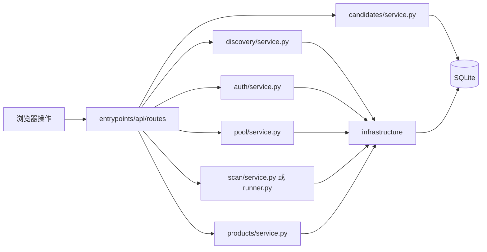

# 代码地图：六个业务模块

`entrypoints/api/routes/` 接收请求，`modules/` 完成业务，`infrastructure/` 提供共用的闲鱼协议、数据读写和规则。请求按这个方向执行；业务模块不直接导入其他业务模块。

## 第一层：项目区域

| 位置 | 用途 |
| --- | --- |
| `README.md` | 安装、运行、常用命令和项目边界。 |
| `pyproject.toml` | Python 依赖、打包、`radar` 与 `radar-web` 命令配置。 |
| `src/xianyu_radar/` | Python 程序源码。 |
| `web/` | `index.html` 与 `app.js` 提供工作台，`common.js` 提供工作台公共工具；`item.html` 与 `item.js` 提供商品详情独立页面；共用样式和图标。 |
| `tests/` | 自动测试；`fixtures/` 是离线闲鱼响应样本。 |
| `scripts/` | 手动冒烟步骤。 |
| `docs/` | 当前代码地图和登录态格式说明。 |
| `data/` | 唯一的运行数据目录：`radar.sqlite3` 数据库、`state/` 登录态和 `debug/` 调试文件；不属于源码。 |
| `PROJECT_ANALYSIS.md`、`SYSTEM_DESIGN.md`、`IMPLEMENTATION_PLAN.md`、`PROGRESS.md` | 项目分析、早期设计、实施计划和进度记录；具体代码位置以本文为准。 |

## 第二层：源码区域

```text
src/xianyu_radar/
├── entrypoints/
│   ├── api/                    HTTP 入口：注册、分发、请求校验、响应转换
│   │   ├── app.py              FastAPI 应用，挂载 web/，注册路由
│   │   ├── server.py           Web 服务启动
│   │   ├── deps.py             数据库连接、会话、时间和事件响应辅助函数
│   │   └── routes/             按 HTTP 地址分发到业务模块
│   └── cli.py                  radar 命令入口；与 API 是并列入口
├── modules/                     六个业务模块；service.py 是各模块对外的主入口
│   ├── auth/                    保存、查看和检查登录态
│   ├── discovery/               搜索商品、发现卖家并入池
│   ├── pool/                    查看商家池、修改商家状态
│   ├── scan/                    扫描商家、比较变化、生成事件和候选
│   ├── candidates/              查看候选商品、修改审核状态
│   └── products/                实时获取并展示单件商品详情
├── infrastructure/              多条业务链路共用的技术能力
│   ├── goofish/                闲鱼会话解析与 MTOP 请求
│   ├── storage/                SQLite 连接、schema、商家数据和认证暂停状态
│   ├── item_identity.py        商品 ID 与 URL 的统一规则
│   └── catalog_quality.py      目录与选品共用的可信扫描判断
├── config.py                    数据路径和扫描参数
├── models.py                    业务链路传递的数据结构
└── __init__.py                  包版本
```

各目录的 `__init__.py` 让 Python 识别包，通常不是业务入口。

### HTTP 门牌与业务入口

| 路由文件 | 用户功能 | 进入的业务模块 |
| --- | --- | --- |
| `routes/auth.py` | 登录态状态、保存、检查、解除暂停 | `auth/service.py` |
| `routes/discover.py` | 按关键词发现商家 | `discovery/service.py` |
| `routes/pool.py` | 查看商家池、改变商家状态 | `pool/service.py` |
| `routes/scan.py` | 扫描单个商家或整个商家池 | `scan/service.py`、`scan/runner.py` |
| `routes/events.py` | 查看扫描产生的商品事件 | `scan/service.py` |
| `routes/candidates.py` | 查看候选及概览、按审核状态筛选、改变候选审核状态 | `candidates/service.py` |
| `routes/products.py` | 获取单件商品详情，处理验证、限流和登录态错误 | `products/service.py` |
| `routes/status.py` | 健康检查与系统概览 | 系统查询 |

`routes/` 按 HTTP 地址分文件，`modules/` 按业务能力分文件。这是两种不同维度：门牌负责接请求，业务区负责完成工作。

工作台导航有五个视图：登录态、发现商家、商家池、扫描变化和候选商品。商家商品目录中的“商品详情”打开独立页面，由第六个模块 `products` 获取商品数据；“查看商品”仍跳转闲鱼。商品、事件和候选列表按页读取。

工作台脚本使用浏览器原生 ES 模块。`app.js` 负责导航与全局刷新，逐步将页面业务移到下表中的文件；公共工具不导入业务页面。独立商品详情页 `item.js` 保持不变。

| 文件 | 职责 |
| --- | --- |
| `web/common.js` | DOM 查询、API 请求、提示、按钮忙碌状态、时间格式化、表格、安全链接和分页工具。 |
| `web/auth.js` | 系统数量、登录态展示、Cookie 校验和保存；通过入口传入的回调切换到登录页。 |
| `web/discovery.js` | 搜索表单、搜索结果、发现历史、诊断及继续任务；打开商家和全局刷新由入口协调。 |

工作台列表读取本地 SQLite：`GET /api/discover/runs`、`GET /api/pool/{seller_id}`、`GET /api/scan/runs`、`GET /api/events` 和 `GET /api/candidates`。开始发现、手动扫描、登录态在线检查会请求闲鱼。商品详情页 `/items/{item_id}` 在打开或点击刷新时调用 `GET /api/items/{item_id}/detail`，实时请求闲鱼；详情统计目前不落库，缺失值显示“未知”。工作台各类刷新请求分别处理失败，页面导航和目录打开独立执行。

### 六个业务模块内部

| 目录 | 文件与职责 |
| --- | --- |
| `auth/` | `service.py`：登录态查看、保存、检查 MTOP 连通性、清除认证暂停。 |
| `discovery/` | `service.py`：发现流程编排、写入发现记录和种子商品；`keyword_search.py`：调用搜索接口；`item_parser.py`：解析搜索结果、提取卖家信息。 |
| `pool/` | `service.py`：商家列表与状态修改的业务入口。实际商家表读写由共用的 `infrastructure/storage/seller_repository.py` 完成。 |
| `scan/` | `service.py`：单商家扫描、落库和事件生成；`runner.py`：逐个扫描商家池及循环调度；`fetcher.py`：拉取店铺商品；`shop_parser.py`：解析店铺列表；`diff.py`：比较前后商品；`item_repository.py`：商品当前态读写；`history.py`：写快照、查扫描记录；`events.py`：查询变化事件；`candidate_detector.py`：根据新商品事件生成候选。 |
| `candidates/` | `service.py`：候选列表与状态修改入口；`repository.py`：候选表查询、状态更新。 |
| `products/` | `service.py`：调用商品详情接口，仅请求商品数据，提取商品信息和统计；不读写商家、扫描或候选表。 |

`infrastructure/goofish/session.py` 从 Cookie JSON 建立会话；`mtop.py` 计算签名并访问闲鱼接口。`infrastructure/storage/db.py` 连接和初始化 SQLite，`schema.sql` 定义表，`seller_repository.py` 读写商家池相关表，`auth_state.py` 管理认证暂停标志。发现和扫描都需要闲鱼协议；发现、商家池和扫描都需要访问商家数据，所以这些代码放在共用区域。

## 第三层：用户进入后会发生什么



箭头表示代码调用方向。六个业务模块之间没有直接 Python 导入。发现、商家池、扫描和候选通过共享 SQLite 数据衔接流程；商品详情通过公共闲鱼客户端取得数据。模块边界测试自动发现业务模块，同时检查基础设施没有反向导入业务模块。

### 数据表职责

“主要维护”表示该表的业务职责；参与者通过现有服务、公共仓库或明确的 SQL 操作衔接数据，并非独占数据库表。

| 表 | 主要维护 | 参与读写与用途 |
| --- | --- | --- |
| `sellers`、`seller_pool_entries` | 商家池；公共 `storage/seller_repository.py` 管理主要读写 | 发现建立商家与来源、冲突时撤销来源；扫描更新扫描时间和失败次数；候选检查池成员资格。 |
| `watch_keywords` | 发现 | 保存已使用的关键词；状态概览读取。 |
| `discovery_runs`、`discovery_pages`、`discovery_items`、`discovery_entries` | 发现 | 记录搜索、卖家识别、断点和诊断；发现 API 查询记录。 |
| `items` | 扫描维护当前目录；公共商家仓库写搜索种子 | 发现写入已识别商品并处理来源冲突；商家池读取目录；候选读取链接、匹配排除规则。 |
| `scans`、`scan_pages`、`item_snapshots`、`item_events` | 扫描 | 商家池读取扫描质量和快照；候选核对最新可信快照；事件 API 只读查询。 |
| `candidates`、`candidate_sellers`、`candidate_sources` | 候选；公共 `storage/candidate_repository.py` 统一来源写入 | 扫描自动添加候选来源；候选模块手动选品、查询和审核。 |
| `candidate_scan_decisions` | 扫描 | 保存基线、排除、候选判断；扫描历史接口读取。 |
| `meta` | 存储基础设施与登录态状态 | `db.py` 维护 schema 版本；扫描标记认证暂停，登录态模块清除暂停。 |

目录是否可选与候选是否可加入，统一使用 `infrastructure/catalog_quality.py` 的 `is_trusted_scan()`。规则为 `status='ok'` 且结束原因是 `end_marker`、`short_page` 或 `total_count`；调用者仍分别检查最新扫描、快照归属和商家成员资格。新增数据库字段必须新增迁移，不通过修改已执行的迁移来升级旧库。

### 1. 保存或检查登录态

`web/app.js` → `routes/auth.py` → `auth/service.py` → `infrastructure/goofish/session.py` 解析 Cookie；需要在线检查时再由 `infrastructure/goofish/mtop.py` 发请求。保存的会话文件在 `data/state/`，认证暂停标志在 SQLite 的 `meta` 表。

### 2. 发现商家

`web/app.js` → `routes/discover.py` → `discovery/service.py` → `keyword_search.py` → `item_parser.py`。搜索使用共用的 MTOP 客户端。解析器从搜索结果中读取明确的数字卖家 ID，也从商品图片地址提取数字候选值。图片候选值只在当前搜索结果中没有跨卖家复用、同一卖家没有多个不同候选值时作为卖家 ID 使用；这一步只检查内存中的搜索结果，不请求商家商品列表。同一搜索卖家的其他商品可关联到这个 ID。仍未识别的商品沿用详情接口补全；遇到人机验证时，如果已有识别的商家，就保留这些商家并在响应中标明 `validation_required`，否则返回 403。无法识别卖家的搜索结果计入 `skipped_no_seller`。本步不调用扫描模块。

### 3. 管理商家池

`routes/pool.py` → `pool/service.py` → `storage/seller_repository.py` → SQLite。查看 `watching` 商家或修改商家状态，都在这一条链里完成。

### 4. 扫描商家

单商家：`routes/scan.py` → `scan/service.py` → `fetcher.py`/`shop_parser.py` 拉取并解析商品 → `item_repository.py` 读取旧商品 → `diff.py` 比较 → `item_repository.py`、`history.py` 保存当前态和快照 → `service.py` 写 `item_events` → `candidate_detector.py` 从非基线 `NEW_ITEM` 中写候选。结果存入 `scans`、`items`、`item_snapshots`、`item_events`、`candidates` 等表。

商家池：`routes/scan.py` → `scan/runner.py` → 共用的商家仓库读取 `watching` 商家 → 对每个商家调用同模块的 `scan/service.py`。循环调度也是 `runner.py`，并由 CLI 触发。

自动测试用 `tests/fixtures/` 的样本模拟闲鱼响应，在临时数据库中验证解析和扫描；对外 API 只使用当前会话发起真实请求。发现阶段已有种子商品也不影响基线判断：某卖家的首次成功店铺扫描始终建档为基线，不生成候选。不完整或数量异常的目录先记录诊断与观测，不直接提交商品变化。

### 5. 查看候选与事件

候选：`web/app.js` → `GET /api/candidates`（`routes/candidates.py`）→ `candidates/service.py` → `candidates/repository.py` → `candidates`、`candidate_sellers` 表。候选列表可按时间、数据质量和审核状态筛选；同一响应的 `summary` 按时间和数据质量汇总状态数量及多商家出现数量。事件：`routes/events.py` → `scan/service.py` → `scan/events.py` → `item_events` 表。这里读取先前扫描写出的结果，没有反向调用扫描执行流程。

### 6. 查看单件商品详情

`web/item.js` → `routes/products.py` → `products/service.py` → `infrastructure/goofish/mtop.py` → `mtop.taobao.idle.pc.detail`。请求设置 `needSellerDO=false`，响应仅展示商品 ID、标题、售价、发布时间、主图和统计；验证失败时显示提示并允许手动重试。返回链接携带商家 ID，重新打开原商家目录。

## 阅读顺序

想追一个功能时，先找对应 `routes/*.py`，再进入该业务模块的 `service.py`，顺着其导入和函数调用往下看，最后看 `infrastructure/` 和 SQLite 表。不要只按目录上下位置猜调用方向；以函数调用和导入为准。
