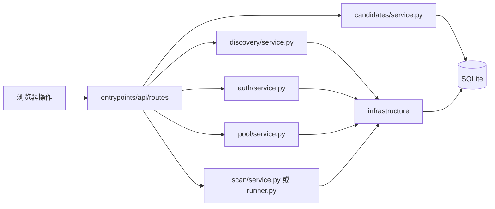

# 代码地图：五条业务路线

把目录当作地图看：`entrypoints/api/routes/` 是用户进入项目的门，`modules/` 是五块业务区域，`infrastructure/` 是各区域共用的通道与仓库工具。目录在磁盘上同级，并不表示运行时也同级：请求由 API 入口进入业务模块，业务模块使用基础设施，最后返回结果。

## 第一层：项目区域

| 位置 | 用途 |
| --- | --- |
| `README.md` | 安装、运行、常用命令和项目边界。 |
| `pyproject.toml` | Python 依赖、打包、`radar` 与 `radar-web` 命令配置。 |
| `src/xianyu_radar/` | Python 程序源码。 |
| `web/` | 浏览器页面：`index.html` 页面结构、`styles.css` 样式、`app.js` 发 HTTP 请求并展示结果。 |
| `tests/` | 自动测试；`fixtures/` 是离线闲鱼响应样本。 |
| `scripts/` | 数据隔离脚本与手动冒烟步骤。 |
| `docs/` | 当前代码地图和登录态格式说明。 |
| `data/prod/`、`data/demo/` | 运行时的正式数据与演示数据；SQLite 数据库和 Cookie 文件在这里，不属于源码。 |
| `PROJECT_ANALYSIS.md`、`SYSTEM_DESIGN.md`、`IMPLEMENTATION_PLAN.md`、`PROGRESS.md` | 项目分析、早期设计、实施计划和进度记录；具体代码位置以本文为准。 |

## 第二层：源码区域

```text
src/xianyu_radar/
├── entrypoints/
│   ├── api/                    HTTP 入口：注册、分发、请求校验、响应转换
│   │   ├── app.py              FastAPI 应用，挂载 web/，注册路由
│   │   ├── server.py           Web 服务启动
│   │   ├── deps.py             数据库连接、会话、时间和事件响应辅助函数
│   │   └── routes/             按 HTTP 地址分发到业务模块
│   └── cli.py                  radar 命令入口；与 API 是并列入口
├── modules/                     五个业务模块；service.py 是各模块对外的主入口
│   ├── auth/                    保存、查看和检查登录态
│   ├── discovery/               搜索商品、发现卖家并入池
│   ├── pool/                    查看商家池、修改商家状态
│   ├── scan/                    扫描商家、比较变化、生成事件和候选
│   └── candidates/              查看候选商品、修改审核状态
├── infrastructure/              多条业务链路共用的技术能力
│   ├── goofish/                闲鱼会话解析与 MTOP 请求
│   ├── storage/                SQLite 连接、schema、商家数据和认证暂停状态
│   └── item_identity.py        商品 ID 与 URL 的统一规则
├── config.py                    环境、路径和扫描参数
├── models.py                    业务链路传递的数据结构
└── __init__.py                  包版本
```

各目录的 `__init__.py` 让 Python 识别包，通常不是业务入口。

### HTTP 门牌与业务入口

| 路由文件 | 用户功能 | 进入的业务模块 |
| --- | --- | --- |
| `routes/auth.py` | 登录态状态、保存、检查、解除暂停 | `auth/service.py` |
| `routes/discover.py` | 按关键词发现商家 | `discovery/service.py` |
| `routes/pool.py` | 查看商家池、改变商家状态 | `pool/service.py` |
| `routes/scan.py` | 扫描单个商家或整个商家池 | `scan/service.py`、`scan/runner.py` |
| `routes/events.py` | 查看扫描产生的商品事件 | `scan/service.py` |
| `routes/candidates.py` | 查看候选、改变候选审核状态 | `candidates/service.py` |
| `routes/status.py`、`env.py`、`demo.py` | 系统概览、环境切换、离线演示；属于系统入口 | 系统查询或演示编排 |

`routes/` 按 HTTP 地址分文件，`modules/` 按业务能力分文件。这是两种不同维度：门牌负责接请求，业务区负责完成工作。`demo.py` 为演示而顺序调用发现与扫描；正常的单项业务路由只进入对应模块。

### 五块业务区内部

| 目录 | 文件与职责 |
| --- | --- |
| `auth/` | `service.py`：登录态查看、保存、检查 MTOP 连通性、清除认证暂停。 |
| `discovery/` | `service.py`：发现流程编排、写入发现记录和种子商品；`keyword_search.py`：调用搜索接口或读取搜索夹具；`item_parser.py`：解析搜索结果、提取卖家信息。 |
| `pool/` | `service.py`：商家列表与状态修改的业务入口。实际商家表读写由共用的 `infrastructure/storage/seller_repository.py` 完成。 |
| `scan/` | `service.py`：单商家扫描、落库和事件生成；`runner.py`：逐个扫描商家池及循环调度；`fetcher.py`：拉取店铺商品；`shop_parser.py`：解析店铺列表；`diff.py`：比较前后商品；`item_repository.py`：商品当前态读写；`history.py`：写快照；`events.py`：查询变化事件；`candidate_detector.py`：根据新商品事件生成候选。 |
| `candidates/` | `service.py`：候选列表与状态修改入口；`repository.py`：候选表查询、状态更新。 |

`infrastructure/goofish/session.py` 从 Cookie JSON 建立会话；`mtop.py` 计算签名并访问闲鱼接口。`infrastructure/storage/db.py` 连接和初始化 SQLite，`schema.sql` 定义表，`seller_repository.py` 读写商家池相关表，`auth_state.py` 管理认证暂停标志，`isolate_env.py` 迁移演示数据。发现和扫描都需要闲鱼协议；发现、商家池和扫描都需要访问商家数据，所以这些代码放在共用区域。

## 第三层：用户进入后会发生什么



箭头表示代码调用方向。五个 `modules/` 子目录之间没有直接 Python 导入。它们可以读写同一个 SQLite 数据库：例如发现把商家入池，后来的扫描再从池中读取；扫描写出候选，候选模块后来读取。这是**通过数据衔接业务流程**，不是 `discovery.py` 直接调用 `scan.py`。

### 1. 保存或检查登录态

`web/app.js` → `routes/auth.py` → `auth/service.py` → `infrastructure/goofish/session.py` 解析 Cookie；需要在线检查时再由 `infrastructure/goofish/mtop.py` 发请求。保存的会话文件在 `data/<env>/state/`，认证暂停标志在 SQLite 的 `meta` 表。

### 2. 发现商家

`web/app.js` → `routes/discover.py` → `discovery/service.py` → `keyword_search.py` → `item_parser.py`。在线搜索使用共用的 MTOP 客户端；离线模式读取 `tests/fixtures/`。发现流程再使用 `storage/seller_repository.py` 写入 `sellers`、`seller_pool_entries` 和种子 `items`，并记录 `watch_keywords`、`discovery_runs`。本步结束，扫描尚未被直接调用。

### 3. 管理商家池

`routes/pool.py` → `pool/service.py` → `storage/seller_repository.py` → SQLite。查看 `watching` 商家或修改商家状态，都在这一条链里完成。

### 4. 扫描商家

单商家：`routes/scan.py` → `scan/service.py` → `fetcher.py`/`shop_parser.py` 拉取并解析商品 → `item_repository.py` 读取旧商品 → `diff.py` 比较 → `item_repository.py`、`history.py` 保存当前态和快照 → `service.py` 写 `item_events` → `candidate_detector.py` 从非基线 `NEW_ITEM` 中写候选。结果存入 `scans`、`items`、`item_snapshots`、`item_events`、`candidates` 等表。

商家池：`routes/scan.py` → `scan/runner.py` → 共用的商家仓库读取 `watching` 商家 → 对每个商家调用同模块的 `scan/service.py`。循环调度也是 `runner.py`，并由 CLI 触发。

离线夹具扫描同样进入 `scan/service.py`，只省去在线拉取。发现阶段已有种子商品时，第一次店铺扫描不一定是完整基线；这取决于库里是否已有该商家的商品当前态。

### 5. 查看候选与事件

候选：`routes/candidates.py` → `candidates/service.py` → `candidates/repository.py` → `candidates`、`candidate_sellers` 表。事件：`routes/events.py` → `scan/service.py` → `scan/events.py` → `item_events` 表。这里读取先前扫描写出的结果，没有反向调用扫描执行流程。

## 阅读顺序

想追一个功能时，先找对应 `routes/*.py`，再进入该业务模块的 `service.py`，顺着其导入和函数调用往下看，最后看 `infrastructure/` 和 SQLite 表。不要只按目录上下位置猜调用方向；以函数调用和导入为准。
